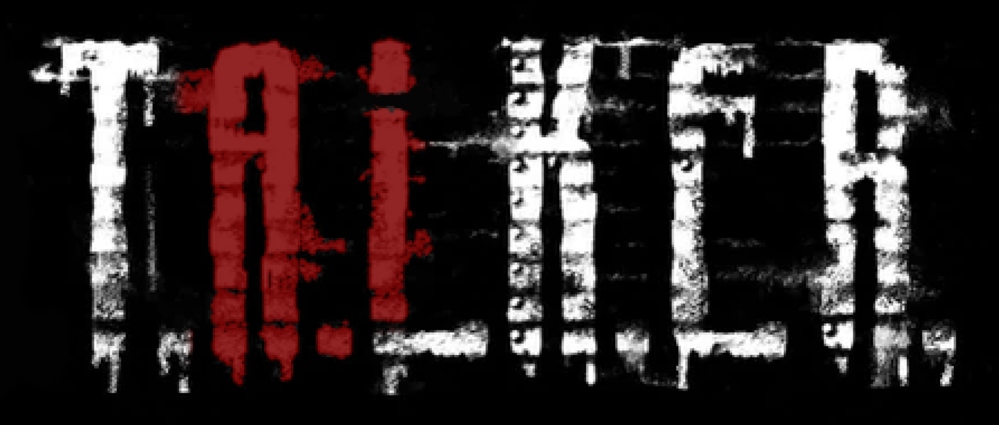

# TALKER
A LLM powered dialogue generator for STALKER Anomaly

## notes
You will need openAI api credits to be able to use this mod! Changing the LLM model is possible, I left a door open for it at least in the code if anyone wants to give it a shot.

This mod is provided free of charge with open code, practice your own due diligence and set spending limits on your account. I have tested for bugs that could cause large amounts of requests but that does not mean it's impossible!

## installation instructions
Best to use [Mod Organizer](https://lazystalker.blogspot.com/2020/11/mod-organizer-2-stalker-anomaly-setup.html)

### get an openapi key
https://www.howtogeek.com/885918/how-to-get-an-openai-api-key/
put it in the openAi_API_KEY.key file as it was a text file

### the game
1. place TALKER in a new mod folder, unpacked (For Gamma this is in E:\GAMMA\mods)
2. run talker_mic.exe and paste in your key
3. if it says everything's okay, keep it running and launch the game
4. you should be able to start speaking using the left alt key

If you dont want to use the mic, you can still use the exe to add the key and then close it.

## credits
Many thanks to
- [balls of pure diamond](https://www.youtube.com/@BallsOfPureDiamond), for making cool youtube videos and helping me brainstorm, playtest and stay hyped
- ThorsDecree
- the many extremely helpful modders in the Anomaly discord
- Tosox
- RavenAscendant
- NLTP_ASHES
- Thial
- Lucy
- xcvb
- momopate
- Darkasleif
- Mirrowel
- Encrypterr
- lethrington
- Dunc
- Demonized
- Majorowsky
- beemanbp03
- abbihors, for boldly going where no stalker mod has gone before
- (Buckwheat in Russian) helping investigate pollnet
- many more who I rudely forgot
